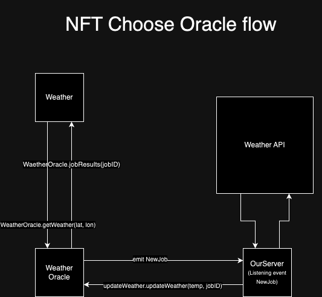

# Solidity Oracle Weather

Learn how to create oracle with Solidity and Nodejs

Became a Blockchain developer watching [NFT Choose](https://www.youtube.com/@nftchoose) on Youtube.



```shell
# running oracle server and listening WeatherOracle smart contract
npm run server
# running transaction of Weather smart contract
npm run server
```

```shell
npx hardhat help
npx hardhat test
GAS_REPORT=true npx hardhat test
npx hardhat node
npx hardhat run scripts/deploy.ts
```
